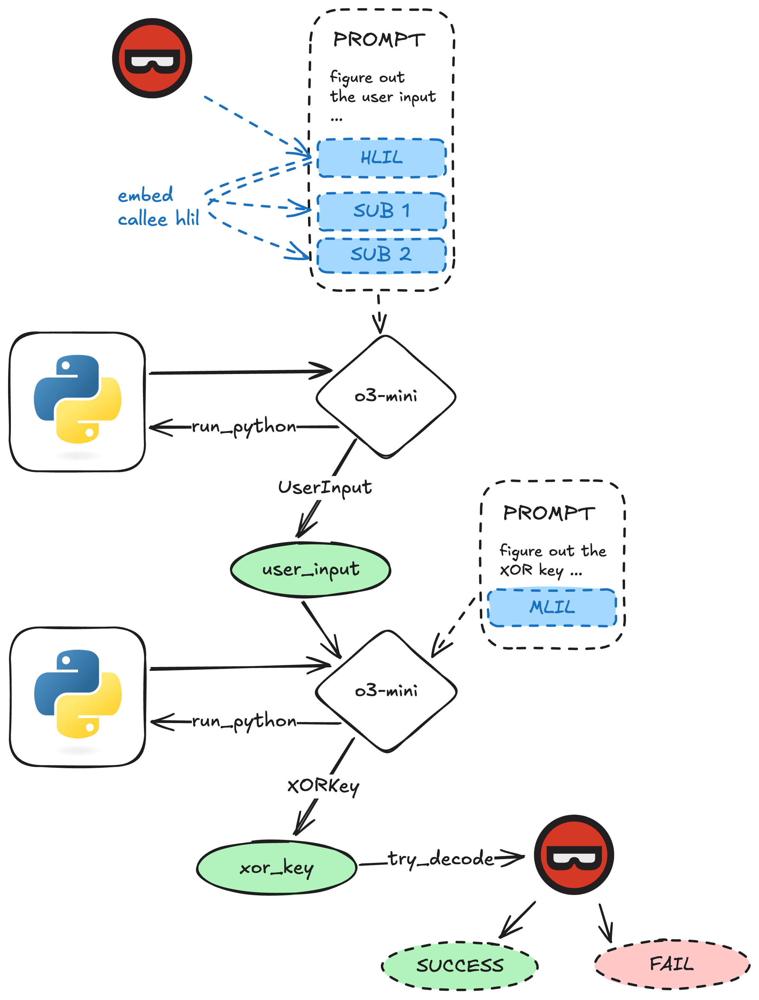

# nfuncs agent

A simple python-equipped agent to solve the `nfuncs` challenge from DEF CON 2025 Quals.

## Usage

You will need Binary Ninja (with API access) and an OpenAI API key.

You will also need to download the `nfuncs.exe` binary (3 GB) (see [nfuncs_0.0.1.7z.torrent](./nfuncs_0.0.1.7z.torrent)).

Create a `.env` file with an `OPENAI_API_KEY` variable. (Optionally set `LANGCHAIN_*` variables to enable tracing.)

Run `python3 solve.py`.

## Notes

This was built during the CTF, so the code is a bit messy. Its just intended to be a proof of concept.
